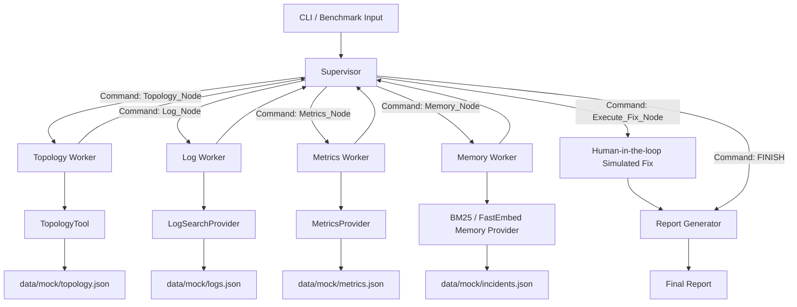

# Incident Diagnostic Harness

A CLI-first microservice incident diagnostic agent built with LangGraph,
Pydantic contracts, DeepSeek-compatible model routing, local retrieval, and
versioned prompts.

The project is designed as an engineering harness rather than a single prompt
demo: the supervisor routes work, worker nodes call tools, tools retrieve
evidence, context strategies shape evidence, and report generators produce
operator-facing output.

## What It Does

- Accepts a plain-text incident description from the CLI.
- Routes diagnosis through a LangGraph main-agent / sub-agent workflow.
- Enforces routing and report outputs with Pydantic v2 contracts.
- Looks up service blast radius from mock topology data.
- Retrieves similar historical incidents with local BM25.
- Supports DeepSeek V4 Pro / Flash through an OpenAI-compatible endpoint.
- Generates structured incident reports through template or LLM strategy.
- Supports optional human approval before simulated fix execution.
- Provides benchmark output for route, latency, token estimate, and fallback count.
- Runs locally through `uv` or as a Dockerized CLI.

## Architecture



Layering:

| Layer | Path | Responsibility |
| --- | --- | --- |
| Graph control plane | `src/agents/` | Supervisor routing, worker nodes, LangGraph `Command` transitions |
| Contracts and state | `src/core/` | `EngineState`, Pydantic contracts, model config |
| Prompt registry | `prompts/`, `src/prompts/` | Versioned Markdown prompts for supervisor and report writer |
| Tools | `src/tools/` | Topology lookup, log search, metrics lookup, memory retrieval, JSON store, BM25 |
| Context strategy | `src/context/` | Convert raw tool results into compact state summaries |
| Reporting | `src/reporting/` | Template and LLM report generation |
| Mock data | `data/mock/` | Service topology, logs, metrics, and 50 historical incidents |
| Evaluation | `scripts/` | Benchmark runner |

## Quick Start

Install dependencies:

```bash
uv sync
```

Create local model configuration:

```bash
cp .env.example .env
```

Edit `.env` and set your DeepSeek API key:

```env
OPENAI_API_KEY=your_deepseek_api_key
OPENAI_BASE_URL=https://api.deepseek.com
```

The project stays runnable without an API key because deterministic routing and
template reporting are enabled by default.

Run a diagnosis:

```bash
uv run python main.py "排查用户中心 Token Expired 报错"
```

Show active model and retrieval configuration:

```bash
uv run python main.py --show-config "排查用户中心 Token Expired 报错"
```

Enable real LLM routing and report generation for one run:

```bash
INCIDENT_ENABLE_LLM_ROUTING=true INCIDENT_ENABLE_LLM_REPORT=true \
uv run python main.py "排查用户中心 Token Expired 报错"
```

Run with human approval before simulated fix execution:

```bash
uv run python main.py --human-in-loop "排查用户中心 Token Expired 报错"
```

## Configuration

Important `.env` settings:

| Variable | Default | Purpose |
| --- | --- | --- |
| `OPENAI_BASE_URL` | `https://api.deepseek.com` | DeepSeek OpenAI-compatible endpoint |
| `INCIDENT_PRIMARY_MODEL` | `deepseek-v4-pro` | Primary reasoning model |
| `INCIDENT_SUPERVISOR_MODEL` | `deepseek-v4-flash` | Structured routing model |
| `INCIDENT_FALLBACK_MODEL` | `deepseek-v4-flash` | LLM fallback model |
| `INCIDENT_REPORT_MODEL` | `deepseek-v4-pro` | Structured report model |
| `INCIDENT_MEMORY_PROVIDER` | `bm25` | Memory retrieval provider |
| `INCIDENT_RAG_EMBEDDING_MODEL` | `BAAI/bge-small-zh-v1.5` | Free local embedding recommendation |
| `INCIDENT_ENABLE_LLM_ROUTING` | `false` | Enable LLM supervisor routing |
| `INCIDENT_ENABLE_LLM_REPORT` | `false` | Enable LLM report generation |
| `INCIDENT_DEEPSEEK_THINKING` | `disabled` | Disable thinking mode for structured JSON calls |

Vector retrieval is optional. The harness keeps `INCIDENT_MEMORY_PROVIDER=bm25`
by default so it runs without downloading embedding dependencies. To test local
BGE retrieval later, install `fastembed` and set `INCIDENT_MEMORY_PROVIDER=fastembed`.

## Examples

Reproducible case walkthroughs live in `examples/`:

- [Token Expired](examples/token_expired.md)
- [Payment Timeout](examples/payment_timeout.md)
- [Redis Session Timeout](examples/redis_session_timeout.md)

Each example includes an input query, expected route, evidence source, and
expected report focus.

## Benchmark

```bash
uv run python scripts/run_benchmark.py
```

The benchmark prints:

- query
- route path
- end-to-end latency
- offline token estimate
- fallback count

## Run Telemetry

Each CLI and benchmark execution is persisted to local SQLite:

```text
runs/incident_runs.sqlite3
```

The database stores:

- run id
- query
- route path
- per-phase event snapshots
- total latency
- final report
- routing/report fallback errors

List recent runs:

```bash
uv run python scripts/list_runs.py
```

## Docker

Build the CLI image:

```bash
docker build -t incident-diagnostic-harness:local .
```

Run a diagnosis with local `.env` injected at runtime:

```bash
docker run --rm --env-file .env incident-diagnostic-harness:local "排查用户中心 Token Expired 报错"
```

Run through Docker Compose:

```bash
docker compose run --rm incident-harness "排查用户中心 Token Expired 报错"
```

Show model configuration in the container:

```bash
docker compose run --rm incident-harness --show-config "排查用户中心 Token Expired 报错"
```

Run the benchmark in the container:

```bash
docker compose run --rm --entrypoint uv incident-harness run python scripts/run_benchmark.py
```

## Test

```bash
uv run python -m unittest discover -s tests
```

## Design Docs

- [English design doc](docs/agent-design.md)
- [中文设计文档](docs/agent-design.zh.md)

## Resume Highlights

This project demonstrates:

- LangGraph-based hierarchical multi-agent orchestration.
- Pydantic-enforced routing and report contracts.
- OpenAI-compatible DeepSeek integration with model fallback.
- Versioned prompt registry for supervisor and report sub-agents.
- Retrieval abstraction for BM25 and future local embedding search.
- Human-in-the-loop interruption before simulated remediation.
- Dockerized CLI runtime and benchmark pipeline.
