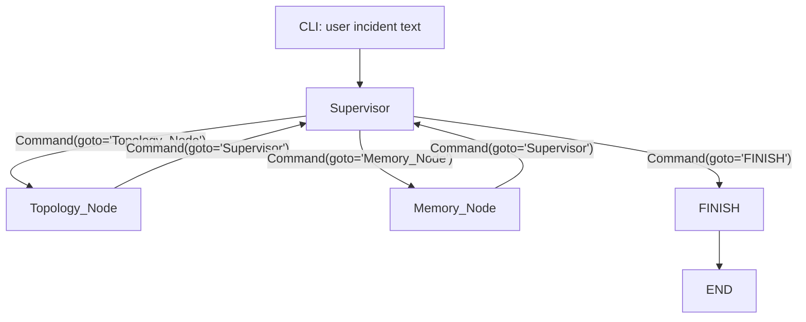

# Incident Diagnostic Harness Agent Design

## 1. Design Intent

This project is a pure backend CLI control plane for diagnosing cascading
microservice incidents. The first version intentionally avoids real databases
and external retrieval systems. Its purpose is to prove that the runtime can:

- accept a plain-language incident from a terminal;
- route work through a LangGraph state machine;
- validate every supervisor routing decision with a Pydantic contract;
- isolate high-value diagnostic evidence from the conversational message stream;
- generate a deterministic final report that can later be benchmarked.

The agent is not a monolithic ReAct loop. It is a hierarchical multi-agent
runtime where the supervisor owns planning and routing, while worker nodes own
domain-specific evidence collection.

## 2. Architectural Principles

### 2.1 CLI First

The runtime exposes a terminal interface through `rich`. There is no web
frontend, no browser state, and no frontend framework dependency. All visible
execution progress is rendered by the CLI layer.

### 2.2 Contract First

The supervisor must emit an `AgentHandoffCommand`. The graph never routes based
on untyped free text. If an LLM is used, it is bound with
`ChatOpenAI.with_structured_output(AgentHandoffCommand)`.

### 2.3 State Is the Integration Boundary

Nodes communicate only through `EngineState`. Worker nodes do not call each
other directly. The CLI does not inspect internal worker implementation details;
it reads state transitions and messages.

### 2.4 Presentation Is Decoupled From Execution

Graph nodes should not print directly. They return state updates. The CLI owns
all terminal rendering, which keeps the graph testable and allows later API or
batch runners to reuse the same engine without terminal noise.

### 2.5 Deterministic Fallback

Sprint 1 must be runnable without an OpenAI API key. If `OPENAI_API_KEY` is not
set, or if the LLM route fails, the supervisor falls back to a deterministic
local router. This keeps the control plane verifiable offline.

## 3. Runtime Components

### 3.1 `EngineState`

Defined in `src/core/state.py`.

| Field | Type | Owner | Purpose |
| --- | --- | --- | --- |
| `messages` | `Annotated[list[BaseMessage], operator.add]` | All nodes | Append-only interaction and node observation stream. |
| `current_phase` | `str` | Current node | Human-readable execution phase for CLI and benchmark traces. |
| `impact_summary` | `str` | `Topology_Node` | Isolated topology impact surface. Kept out of raw messages so downstream prompts can use a compact field. |
| `memory_summary` | `str` | `Memory_Node` | Isolated historical incident summary. This is the Sprint 1 placeholder for Sprint 2 retrieval output. |
| `final_report` | `str` | `FINISH` | Final CLI deliverable. |
| `handoff_trace` | `Annotated[list[dict[str, str]], operator.add]` | `Supervisor` | Append-only route audit trail. Useful for debugging, benchmark reports, and architecture comparisons. |
| `routing_errors` | `Annotated[list[str], operator.add]` | `Supervisor` | Captures LLM or contract failures that triggered deterministic fallback. |

Design note: `impact_summary` is deliberately separate from `messages`. The
message stream is useful for conversational traceability, but state fields are
better for compact, stable, benchmarkable evidence.

### 3.2 `AgentHandoffCommand`

Defined in `src/core/contracts.py`.

Fields:

- `reasoning`: required explanation of the route decision.
- `next_worker`: one of `Topology_Node`, `Memory_Node`, `FINISH`.
- `instruction`: task-specific instruction for the selected downstream node.

The model uses `extra="forbid"` so unexpected LLM fields fail validation instead
of silently entering the control plane.

### 3.3 `Supervisor`

Defined in `src/agents/graph_builder.py`.

Responsibilities:

- read the current `EngineState`;
- produce an `AgentHandoffCommand`;
- apply phase guards so the graph does not finish before required evidence is
  present;
- append an audit record to `handoff_trace`;
- route by returning `Command(goto=...)`.

The supervisor currently supports two routing modes:

| Mode | Trigger | Behavior |
| --- | --- | --- |
| LLM structured routing | `OPENAI_API_KEY` exists | Calls `ChatOpenAI.with_structured_output(AgentHandoffCommand)`. |
| Deterministic fallback | No API key or LLM exception | Routes `Topology_Node -> Memory_Node -> FINISH` based on missing state fields. |

Phase guards are intentionally separate from Pydantic validation. Pydantic
answers "is this route syntactically legal?" while phase guards answer "is this
route legal for the current workflow state?"

### 3.4 `Topology_Node`

Sprint 1 behavior:

- does not read a real graph database;
- returns a mock topology impact summary;
- writes only `impact_summary` and an `AIMessage`;
- routes back to `Supervisor` with `Command(goto="Supervisor")`.

Sprint 2 replacement point:

- replace the hard-coded summary with a reader for `data/mock/topology.json`;
- keep the output contract as `impact_summary: str`;
- avoid leaking raw graph records into `messages` unless needed for debugging.

### 3.5 `Memory_Node`

Sprint 1 behavior:

- does not read a real memory database;
- returns a mock historical incident summary;
- writes only `memory_summary` and an `AIMessage`;
- routes back to `Supervisor`.

Sprint 2 replacement point:

- replace the hard-coded summary with BM25 or local vector retrieval over
  `data/mock/incidents.json`;
- keep the output contract as `memory_summary: str`;
- later add structured evidence fields only if benchmark or report generation
  needs them.

### 3.6 `FINISH`

The finish node is deterministic in Sprint 1. It combines:

- original user request;
- `impact_summary`;
- `memory_summary`;
- fixed diagnostic guidance.

It writes the final string to `final_report` and appends an `AIMessage` for
traceability.

### 3.7 CLI

Defined in `src/cli/main.py`.

Responsibilities:

- parse command-line incident text or prompt interactively;
- initialize `EngineState`;
- stream graph values;
- render route phases, supervisor decisions, mock worker progress, fallbacks,
  and final report with `rich`.

The CLI is intentionally thin. It should not implement routing decisions,
retrieval logic, or report synthesis.

## 4. Graph Topology



No `add_conditional_edges` are used. Dynamic routing is expressed through
`Command(goto=...)`.

## 5. Execution Trace

Expected Sprint 1 route:

1. CLI creates state with a `HumanMessage`.
2. Supervisor sees missing `impact_summary` and routes to `Topology_Node`.
3. Topology node writes mock impact data and routes back.
4. Supervisor sees missing `memory_summary` and routes to `Memory_Node`.
5. Memory node writes mock incident memory and routes back.
6. Supervisor sees required evidence and routes to `FINISH`.
7. Finish node writes `final_report`.

## 6. Extension Points

### 6.1 Alternative Supervisor Strategies

The current supervisor can be compared against future strategies by keeping the
same input and output contract:

```text
EngineState -> AgentHandoffCommand -> Command
```

Candidate strategies:

- deterministic finite-state router;
- LLM structured router;
- LLM router with retry/self-correction;
- rules plus LLM tie-breaker;
- cost-aware router that avoids memory retrieval for simple incidents.

Comparison dimensions:

- route accuracy;
- number of graph steps;
- latency;
- token usage;
- failure rate;
- final-report quality;
- debuggability of `handoff_trace`.

### 6.2 Alternative Topology Providers

Keep the node output stable:

```text
Topology provider -> impact_summary: str
```

Provider candidates:

- hard-coded Sprint 1 mock;
- JSON file reader;
- Neo4j query adapter;
- service catalog adapter;
- Kubernetes owner-reference adapter.

### 6.3 Alternative Memory Providers

Keep the node output stable:

```text
Memory provider -> memory_summary: str
```

Provider candidates:

- hard-coded Sprint 1 mock;
- local BM25 over JSON;
- local embedding index;
- Zep-style temporal memory;
- incident-management system adapter.

### 6.4 Report Generation Variants

The current report is deterministic. Future variants can be compared by keeping
the output field stable:

```text
EngineState -> final_report: str
```

Candidate generators:

- deterministic template;
- structured LLM report model;
- severity-aware report template;
- postmortem-ready Markdown generator.

## 7. Failure Handling

Current Sprint 1 behavior:

- LLM failure triggers deterministic fallback.
- Any fallback cause is appended to `routing_errors`.
- Phase guards prevent premature `FINISH`.

Planned Sprint 2 behavior:

- distinguish transport errors, schema validation errors, and invalid phase
  decisions;
- retry schema failures with an explicit correction prompt;
- expose fallback counts in benchmark output.

## 8. Testing Strategy

Minimum tests to add next:

- `test_graph_reaches_finish`: graph returns `current_phase == "finished"`.
- `test_final_report_non_empty`: final report is populated.
- `test_handoff_trace_order`: route order is
  `Topology_Node -> Memory_Node -> FINISH`.
- `test_no_conditional_edges_pattern`: source does not contain
  `add_conditional_edges`.
- `test_contract_rejects_extra_fields`: `AgentHandoffCommand` rejects unknown
  keys.

Sprint 2 tests should add:

- topology JSON fixture lookup;
- incident retrieval ranking;
- supervisor self-correction on malformed route payload.

## 9. Benchmark Readiness

`handoff_trace`, `routing_errors`, and `current_phase` exist so Sprint 3 can
measure:

- graph step count;
- route path;
- fallback count;
- total latency;
- per-node latency;
- token usage when LLM routing is enabled.

The graph should remain callable from non-CLI scripts, especially
`scripts/run_benchmark.py`.

## 10. Current Sprint Status

Sprint 1 is complete after the latest alignment pass:

- environment and directories exist;
- state follows `BaseMessage` and isolates `impact_summary`;
- supervisor uses Pydantic structured output and `Command`;
- dummy nodes validate the route loop;
- CLI streams route progress and final report;
- deterministic fallback supports offline validation.

Remaining intentional gaps belong to Sprint 2 and Sprint 3:

- no real JSON mock data files yet;
- no BM25/vector retrieval yet;
- no human-in-the-loop interrupt;
- no benchmark pipeline yet.
