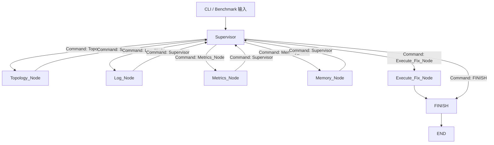

# 微服务故障诊断智能体设计文档

## 1. 设计目标

本项目是一个纯后端 CLI 故障诊断基座，用于验证微服务级联故障诊断的控制面、数据面、上下文策略、工具层和评测层。当前实现覆盖 Sprint 1 到 Sprint 3 的可运行骨架：

- Sprint 1：LangGraph 控制面、Pydantic 路由契约、Rich CLI；
- Sprint 2：Mock 拓扑图谱、历史工单语料、本地 BM25 检索；
- Sprint 3：Human-in-the-loop 模拟修复确认、Benchmark 批量评测。

该系统不是单体 ReAct 循环，而是一个可替换组件的 harness。Supervisor 只负责路由，Worker 节点只负责调用工具并写入状态，工具只负责检索，上下文策略只负责压缩证据，CLI 只负责展示与人工输入。

## 2. 分层架构

| 层 | 目录 | 责任 | 可替换方向 |
| --- | --- | --- | --- |
| 控制面 | `src/agents/` | LangGraph 节点、Supervisor 路由、执行节点、中断点 | 替换 Supervisor 策略、增加新 Worker |
| 状态与契约 | `src/core/` | `EngineState`、Pydantic 契约、消息和路径工具 | 增加状态字段、收紧契约 |
| 上下文策略 | `src/context/` | 将原始工具结果压缩为状态摘要 | Prompt 压缩、证据排序、窗口裁剪 |
| 工具层 | `src/tools/` | JSON 读取、拓扑查询、日志检索、指标查询、记忆检索、文本匹配 | Neo4j、CMDB、Loki、Prometheus、Zep、向量库 |
| 数据平面 | `data/mock/` | 本地 Mock 拓扑、日志、指标和 50 条历史工单 | 真实数据库、日志平台、指标平台或工单系统 |
| Prompt 层 | `prompts/` + `src/prompts/` | 版本化 Markdown Prompt 与加载器 | Prompt A/B、领域化 Prompt、严格 JSON Prompt |
| 交互层 | `src/cli/` | Rich CLI、流式状态展示、人工确认 | API、批处理、服务化 |
| 评测层 | `scripts/` | Benchmark、耗时和 Token 估算 | 真实 Token 统计、质量打分 |

核心原则：每层只依赖下层或稳定契约，不跨层读取内部细节。

## 2.1 模型配置面

模型不写死在节点里，而是通过 `.env` 进行角色化配置。提交到仓库的是 `.env.example`，真实 `.env` 被 `.gitignore` 忽略。

当前支持的模型角色：

| 环境变量 | 作用 |
| --- | --- |
| `OPENAI_API_KEY` | DeepSeek API Key。变量名沿用 OpenAI SDK 兼容格式。 |
| `OPENAI_BASE_URL` | DeepSeek OpenAI-compatible endpoint，默认 `https://api.deepseek.com`。 |
| `INCIDENT_PRIMARY_MODEL` | 主推理模型，默认 `deepseek-v4-pro`。 |
| `INCIDENT_SUPERVISOR_MODEL` | Supervisor 结构化路由模型，默认 `deepseek-v4-flash`。 |
| `INCIDENT_FALLBACK_MODEL` | LLM 路由失败时的降级模型，默认 `deepseek-v4-flash`。 |
| `INCIDENT_REPORT_MODEL` | 未来 LLM 报告生成模型，默认 `deepseek-v4-pro`。 |
| `INCIDENT_EMBEDDING_PROVIDER` | Embedding provider，默认 `fastembed`，用于本地免费向量检索。 |
| `INCIDENT_RAG_EMBEDDING_MODEL` | 本地 embedding 模型，默认 `BAAI/bge-small-zh-v1.5`。 |
| `INCIDENT_MEMORY_PROVIDER` | 记忆检索 provider，默认 `bm25`，可切换为 `fastembed`。 |
| `INCIDENT_DEEPSEEK_THINKING` | DeepSeek thinking mode 开关，默认 `disabled`，更适合结构化路由。 |
| `INCIDENT_ENABLE_LLM_ROUTING` | 是否启用 LLM Supervisor 路由。默认 `false`，保持离线可运行。 |
| `INCIDENT_ENABLE_LLM_REPORT` | 是否启用 LLM 结构化报告生成。默认 `false`，保持离线可运行。 |
| `INCIDENT_LLM_TEMPERATURE` | LLM 温度。结构化路由建议保持 `0`。 |

Supervisor 的路由顺序：

```text
INCIDENT_SUPERVISOR_MODEL
  -> INCIDENT_FALLBACK_MODEL
  -> 本地确定性路由
```

这样做的目的：

- 模型替换不需要改 LangGraph 节点；
- 主模型、降级模型、RAG 模型可以独立调优；
- 可以接 OpenAI-compatible 网关；
- `.env.example` 可提交，真实密钥不会进入 Git。

## 2.2 Prompt 层

Prompt 不再写在节点逻辑里，而是放在 `prompts/` 目录：

| 文件 | 用途 |
| --- | --- |
| `prompts/supervisor_system_v1.md` | Supervisor 结构化路由 system prompt。 |
| `prompts/supervisor_user_v1.md` | Supervisor 路由 user prompt 模板。 |
| `prompts/report_system_v1.md` | 结构化诊断报告 system prompt。 |
| `prompts/report_user_v1.md` | 结构化诊断报告 user prompt 模板。 |

加载器位于 `src/prompts/loader.py`，负责读取 Markdown 模板并注入变量。这样后续调 Prompt、做 A/B、做不同行业版本，不需要改 LangGraph 节点代码。

## 3. 状态契约

`EngineState` 定义在 `src/core/state.py`。

| 字段 | 类型 | 写入方 | 用途 |
| --- | --- | --- | --- |
| `messages` | `Annotated[list[BaseMessage], operator.add]` | 所有节点 | 追加式消息流，记录用户输入、路由决策和节点观测。 |
| `current_phase` | `str` | 当前节点 | 当前执行阶段，供 CLI 和 Benchmark 展示。 |
| `impact_summary` | `str` | `Topology_Node` | 拓扑影响面摘要，避免将图谱原始数据塞进消息流。 |
| `memory_summary` | `str` | `Memory_Node` | 历史相似故障摘要，由检索结果压缩得到。 |
| `log_summary` | `str` | `Log_Node` | 当前故障窗口的日志证据摘要。 |
| `metrics_summary` | `str` | `Metrics_Node` | 当前故障窗口的指标证据摘要。 |
| `fix_plan` | `str` | `Execute_Fix_Node` | 模拟修复计划。 |
| `fix_execution_result` | `str` | `Execute_Fix_Node` | 模拟修复执行结果。 |
| `enable_fix_execution` | `bool` | CLI/Benchmark | 是否启用人类在环修复执行路径。 |
| `operator_feedback` | `str` | CLI | 人类拒绝执行时的反馈。 |
| `final_report` | `str` | `FINISH` | 最终诊断报告。 |
| `handoff_trace` | `Annotated[list[dict[str, str]], operator.add]` | `Supervisor` | 路由审计轨迹，用于复盘和横向评测。 |
| `routing_errors` | `Annotated[list[str], operator.add]` | `Supervisor` | LLM 或契约失败后的降级原因。 |

设计上，`messages` 用于追踪过程，`impact_summary`、`memory_summary` 等状态字段用于承载稳定证据。后续调 Prompt 或报告模板时，可以只改上下文策略，不影响图结构。

## 4. 路由契约

`AgentHandoffCommand` 定义在 `src/core/contracts.py`。

字段：

- `reasoning`：本次路由原因；
- `next_worker`：只允许 `Topology_Node`、`Memory_Node`、`Execute_Fix_Node`、`FINISH`；
- `instruction`：传给下游节点的任务说明。

契约启用 `extra="forbid"`，避免 LLM 输出额外字段进入控制面。Supervisor 的阶段守卫会进一步保证：即便结构合法，也不能在缺少拓扑或记忆证据时提前结束。

## 5. 图结构



系统不使用 `add_conditional_edges`。所有动态路由都通过 `Command(goto=...)` 表达。

## 6. 组件职责

### 6.1 Supervisor

职责：

- 读取当前 `EngineState`；
- 生成 `AgentHandoffCommand`；
- 写入 `handoff_trace`；
- 执行阶段守卫；
- 返回 `Command(goto=...)`。

当前支持两种路由模式：

| 模式 | 触发条件 | 行为 |
| --- | --- | --- |
| LLM 结构化路由 | 存在 `OPENAI_API_KEY` | 使用 `ChatOpenAI.with_structured_output(AgentHandoffCommand)`。 |
| 本地确定性路由 | 无 API Key 或 LLM 异常 | 按状态缺口路由：拓扑、记忆、修复执行或结束。 |

### 6.2 Topology Node

职责：

- 根据用户输入调用 `TopologyTool`；
- 从 `data/mock/topology.json` 匹配服务名或别名；
- 通过 `DiagnosticContextStrategy` 生成 `impact_summary`；
- 返回 Supervisor。

替换方式：

- 将 `TopologyTool` 替换为 Neo4j 查询器；
- 或替换为服务目录、CMDB、Kubernetes 资源关系查询器；
- 保持输出 `impact_summary: str` 不变。

### 6.3 Memory Node

### 6.3 Log Node

职责：

- 根据用户请求和拓扑影响面查询当前故障窗口日志；
- 提取错误等级、异常信息、trace id 和相关服务；
- 写入 `log_summary`；
- 返回 Supervisor。

替换方式：

- 将 `MockLogProvider` 替换为 Loki、ELK、Datadog 或云日志检索；
- 保持输出 `log_summary: str` 不变。

### 6.4 Metrics Node

职责：

- 根据用户请求和拓扑影响面查询当前故障窗口指标；
- 提取错误率、延迟、资源使用率和基线偏离；
- 写入 `metrics_summary`；
- 返回 Supervisor。

替换方式：

- 将 `MockMetricsProvider` 替换为 Prometheus、Datadog、CloudWatch 或云监控；
- 保持输出 `metrics_summary: str` 不变。

### 6.5 Memory Node

职责：

- 将用户请求和 `impact_summary` 合并成检索 query；
- 调用 `MemoryTool`；
- 对 `data/mock/incidents.json` 中 50 条历史工单做 BM25 检索；
- 通过上下文策略生成 `memory_summary`；
- 返回 Supervisor。

替换方式：

- 将 `SimpleBM25` 替换为向量索引；
- 将 JSON 语料替换为 Zep、工单系统或日志平台；
- 保持输出 `memory_summary: str` 不变。

### 6.6 Execute Fix Node

职责：

- 生成模拟修复计划；
- 写入模拟执行结果；
- 不执行真实生产变更。

启用 `--human-in-loop` 时，图会通过 `interrupt_before=["Execute_Fix_Node"]` 在执行前暂停。CLI 提示 `[y/N]`：

- `y`：恢复图执行，进入模拟修复节点；
- `n`：记录 `operator_feedback`，关闭执行路径，直接收敛报告。

### 6.7 Finish Node

职责：

- 汇总用户请求、拓扑影响面、历史记忆、修复计划、执行结果和人工反馈；
- 生成确定性 `final_report`；
- 作为 CLI 和 Benchmark 的统一输出。

## 7. 数据平面

`data/mock/topology.json` 包含网关、用户中心、鉴权中心、Redis、用户库、KMS、订单、支付、库存、风控等服务，以及上下游依赖和 owner。

`data/mock/incidents.json` 包含 50 条历史故障，每条包含：

- `id`
- `service`
- `symptom`
- `root_cause`
- `resolution`
- `tags`

当前检索是本地离线 BM25，不依赖网络和外部数据库。

## 8. 上下文策略

`DiagnosticContextStrategy` 定义在 `src/context/strategy.py`。

它负责把工具返回的结构化结果压缩成可进入状态机的文本摘要：

- `summarize_topology()`：将拓扑命中结果压缩为服务、owner、上游、下游；
- `build_memory_query()`：组合用户请求和拓扑摘要；
- `summarize_memory()`：将相似工单列表压缩为报告可读摘要。

后续可在这里调优：

- top-k 证据数量；
- 摘要长度；
- 是否保留 score；
- 是否按服务、时间、严重等级重排；
- 是否生成面向 LLM 的 Prompt Context 或面向报告的 Evidence Context。

## 9. Benchmark

运行：

```bash
uv run python scripts/run_benchmark.py
```

输出字段：

- Case 编号；
- Query；
- 路由路径；
- 端到端耗时；
- 离线 Token 估算；
- fallback 次数。

当前 Token 是离线估算，后续接入真实 LLM 后可替换为模型返回的 usage。

## 10. 运行命令

初始化本地模型配置：

```bash
cp .env.example .env
```

查看当前模型角色配置：

```bash
uv run python main.py --show-config "排查用户中心 Token Expired 报错"
```

普通诊断：

```bash
uv run python main.py "排查用户中心 Token Expired 报错"
```

人类在环模拟修复：

```bash
uv run python main.py --human-in-loop "排查用户中心 Token Expired 报错"
```

测试：

```bash
uv run python -m unittest discover -s tests
```

Benchmark：

```bash
uv run python scripts/run_benchmark.py
```

## 11. 横向对比维度

### Supervisor 策略

候选：

- 纯确定性路由；
- LLM 结构化路由；
- LLM + 自修正重试；
- 规则优先、LLM 兜底；
- 成本感知路由。

指标：

- 路由准确率；
- 图步数；
- 延迟；
- Token 消耗；
- fallback 次数；
- 最终报告质量；
- `handoff_trace` 可解释性。

### Memory 策略

候选：

- BM25；
- 本地向量，推荐免费中文小模型 `BAAI/bge-small-zh-v1.5`；
- 混合检索；
- Zep 时序记忆；
- 工单系统检索。

指标：

- Top-k 命中率；
- 相似工单相关性；
- 摘要长度；
- 查询延迟；
- 对最终根因判断的帮助度。

### Context 策略

候选：

- 简短摘要；
- 保留结构化证据；
- 按服务链路排序；
- 按历史相似度排序；
- 为不同下游生成不同上下文。

指标：

- Token 成本；
- 报告可读性；
- 证据完整性；
- LLM 路由稳定性。

### Tool Provider

候选：

- JSON Mock；
- Neo4j；
- CMDB；
- Kubernetes；
- 日志平台；
- 工单系统。

指标：

- 数据新鲜度；
- 查询延迟；
- 失败率；
- 接入成本；
- 输出契约稳定性。

## 12. 当前状态

已完成：

- Sprint 1 控制面骨架；
- Pydantic 路由契约；
- LangGraph `Command` 动态路由；
- Rich CLI；
- Mock 拓扑图谱；
- 50 条历史工单；
- 本地 BM25 检索；
- 上下文策略层；
- Human-in-the-loop 模拟修复确认；
- Benchmark 脚本；
- 单元测试。

仍待生产化：

- 接入真实图数据库或服务目录；
- 接入真实工单、日志或时序记忆系统；
- 将 Token 估算替换为真实模型 usage；
- 增加节点级耗时和错误类型；
- 将模拟修复节点替换为真实 runbook 或变更平台；
- 增加更细的评测集和报告质量打分。
