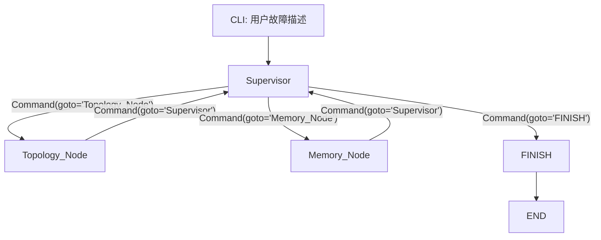

# 微服务故障诊断智能体设计文档

## 1. 设计目标

本项目是一个纯后端 CLI 控制面，用于诊断微服务级联故障。Sprint 1 不连接真实数据库，也不引入真实检索系统，重点验证以下能力：

- 通过终端接收自然语言故障描述；
- 使用 LangGraph 驱动状态机流转；
- 使用 Pydantic v2 强约束 Supervisor 的路由决策；
- 将高价值诊断证据从普通消息流中隔离出来；
- 生成可测试、可复盘、可横向对比的最终诊断报告。

该智能体不是单体 ReAct 循环，而是分层多智能体架构。Supervisor 负责规划与路由，Worker 节点负责特定领域的证据采集。

## 2. 架构原则

### 2.1 CLI 优先

系统只提供终端交互入口，通过 `rich` 渲染执行过程和最终报告。不引入 Web 前端、浏览器状态或前端框架。

### 2.2 契约优先

Supervisor 必须生成 `AgentHandoffCommand`。图不会根据非结构化文本直接路由。如果启用大模型，必须通过 `ChatOpenAI.with_structured_output(AgentHandoffCommand)` 绑定结构化输出。

### 2.3 State 是集成边界

所有节点只通过 `EngineState` 通信。Worker 节点之间不能直接互调。CLI 不读取 Worker 的内部实现细节，只消费状态变化和消息流。

### 2.4 展示与执行解耦

Graph 节点不直接打印终端输出。节点只返回状态更新，CLI 负责所有展示逻辑。这样核心图可以被测试、API 服务或 Benchmark 脚本复用。

### 2.5 确定性降级

Sprint 1 必须能在没有 OpenAI API Key 的情况下运行。如果没有 `OPENAI_API_KEY`，或者 LLM 路由失败，Supervisor 会降级到本地确定性路由器，用于离线验证控制面。

## 3. 运行时组件

### 3.1 `EngineState`

定义位置：`src/core/state.py`

| 字段 | 类型 | 写入方 | 用途 |
| --- | --- | --- | --- |
| `messages` | `Annotated[list[BaseMessage], operator.add]` | 所有节点 | 追加式消息流，用于保留用户输入、Supervisor 决策和 Worker 观测。 |
| `current_phase` | `str` | 当前节点 | 当前诊断阶段，供 CLI、测试和 Benchmark 读取。 |
| `impact_summary` | `str` | `Topology_Node` | 拓扑影响面摘要，与普通消息流隔离，避免污染 Prompt 和报告上下文。 |
| `memory_summary` | `str` | `Memory_Node` | 历史故障记忆摘要，是 Sprint 2 检索结果的占位字段。 |
| `final_report` | `str` | `FINISH` | CLI 最终展示的诊断报告。 |
| `handoff_trace` | `Annotated[list[dict[str, str]], operator.add]` | `Supervisor` | 路由审计轨迹，方便调试、复盘和横向评测。 |
| `routing_errors` | `Annotated[list[str], operator.add]` | `Supervisor` | 记录 LLM 或契约失败后触发降级的原因。 |

设计说明：`impact_summary` 不放在 `messages` 里，是为了让关键证据以稳定、紧凑、可测试的方式传递。消息流适合追踪过程，状态字段适合承载结构化诊断上下文。

### 3.2 `AgentHandoffCommand`

定义位置：`src/core/contracts.py`

字段：

- `reasoning`：必填，解释本次路由决策原因；
- `next_worker`：必填，只允许 `Topology_Node`、`Memory_Node`、`FINISH`；
- `instruction`：必填，传递给下游节点的任务说明。

该模型启用 `extra="forbid"`，如果 LLM 输出未知字段，会直接校验失败，避免非预期字段悄悄进入控制面。

### 3.3 `Supervisor`

定义位置：`src/agents/graph_builder.py`

职责：

- 读取当前 `EngineState`；
- 生成 `AgentHandoffCommand`；
- 执行阶段守卫，避免证据不足时提前结束；
- 写入 `handoff_trace`；
- 返回 `Command(goto=...)` 完成动态路由。

当前 Supervisor 支持两种路由模式：

| 模式 | 触发条件 | 行为 |
| --- | --- | --- |
| LLM 结构化路由 | 存在 `OPENAI_API_KEY` | 使用 `ChatOpenAI.with_structured_output(AgentHandoffCommand)` 生成路由决策。 |
| 本地确定性路由 | 无 API Key 或 LLM 异常 | 根据缺失字段按 `Topology_Node -> Memory_Node -> FINISH` 流转。 |

阶段守卫和 Pydantic 校验是两个层次：Pydantic 判断“输出是否合法”，阶段守卫判断“在当前状态下这样走是否合理”。

### 3.4 `Topology_Node`

Sprint 1 行为：

- 不读取真实图数据库；
- 返回 Mock 拓扑影响面；
- 只写入 `impact_summary` 和一条 `AIMessage`；
- 通过 `Command(goto="Supervisor")` 回到 Supervisor。

Sprint 2 替换点：

- 将硬编码摘要替换为 `data/mock/topology.json` 读取逻辑；
- 保持输出契约仍为 `impact_summary: str`；
- 除非调试需要，不把原始图谱记录塞进 `messages`。

### 3.5 `Memory_Node`

Sprint 1 行为：

- 不读取真实记忆库；
- 返回 Mock 历史故障摘要；
- 只写入 `memory_summary` 和一条 `AIMessage`；
- 回到 Supervisor。

Sprint 2 替换点：

- 将硬编码摘要替换为基于 `data/mock/incidents.json` 的 BM25 或本地向量检索；
- 保持输出契约仍为 `memory_summary: str`；
- 只有当报告生成或 Benchmark 确实需要时，再增加更细的结构化证据字段。

### 3.6 `FINISH`

Sprint 1 的 `FINISH` 节点是确定性的。它组合以下内容：

- 用户原始请求；
- `impact_summary`；
- `memory_summary`；
- 固定诊断建议模板。

最终写入 `final_report`，并追加一条 `AIMessage` 用于过程追踪。

### 3.7 CLI

定义位置：`src/cli/main.py`

职责：

- 解析命令行参数，或在无参数时交互式请求故障描述；
- 初始化 `EngineState`；
- 流式读取图执行状态；
- 使用 `rich` 渲染当前阶段、Supervisor 决策、Mock Worker 进度、降级信息和最终报告。

CLI 是薄展示层，不承担路由、检索或报告生成职责。

## 4. 图结构



系统不使用 `add_conditional_edges`。所有动态路由都通过 `Command(goto=...)` 表达。

## 5. Sprint 1 执行轨迹

标准执行路径：

1. CLI 创建初始状态，并写入一条 `HumanMessage`；
2. Supervisor 发现缺少 `impact_summary`，路由到 `Topology_Node`；
3. Topology 节点写入 Mock 拓扑影响面，并回到 Supervisor；
4. Supervisor 发现缺少 `memory_summary`，路由到 `Memory_Node`；
5. Memory 节点写入 Mock 历史故障摘要，并回到 Supervisor；
6. Supervisor 发现必要证据已经齐备，路由到 `FINISH`；
7. Finish 节点生成 `final_report`。

## 6. 横向对比与扩展点

### 6.1 Supervisor 策略对比

只要保持以下接口不变，就可以替换 Supervisor 策略：

```text
EngineState -> AgentHandoffCommand -> Command
```

候选策略：

- 纯确定性有限状态路由；
- LLM 结构化路由；
- 带重试和自修正的 LLM 路由；
- 规则优先、LLM 兜底；
- 成本感知路由，例如简单故障跳过记忆检索。

对比维度：

- 路由准确率；
- 图执行步数；
- 总耗时；
- Token 消耗；
- 失败率；
- 最终报告质量；
- `handoff_trace` 的可解释性。

### 6.2 Topology Provider 对比

保持节点输出稳定：

```text
Topology provider -> impact_summary: str
```

候选实现：

- Sprint 1 硬编码 Mock；
- JSON 文件读取；
- Neo4j 查询适配器；
- 服务目录适配器；
- Kubernetes owner-reference 适配器。

### 6.3 Memory Provider 对比

保持节点输出稳定：

```text
Memory provider -> memory_summary: str
```

候选实现：

- Sprint 1 硬编码 Mock；
- JSON + BM25；
- 本地 Embedding 索引；
- Zep 风格时序记忆；
- 工单系统适配器。

### 6.4 Report Generator 对比

保持最终输出字段稳定：

```text
EngineState -> final_report: str
```

候选实现：

- 当前确定性模板；
- 结构化 LLM 报告模型；
- 按严重等级切换模板；
- 面向复盘文档的 Markdown 生成器。

## 7. 失败处理

当前 Sprint 1 行为：

- LLM 失败时触发确定性降级；
- 降级原因写入 `routing_errors`；
- 阶段守卫阻止证据不足时提前 `FINISH`。

Sprint 2 计划：

- 区分网络错误、Schema 校验错误和阶段非法错误；
- 对 Schema 错误加入自修正重试 Prompt；
- 在 Benchmark 中统计降级次数和失败类型。

## 8. 测试策略

当前已补充基础单测：

- 图可以走到 `finished`；
- `final_report` 非空；
- `handoff_trace` 顺序为 `Topology_Node -> Memory_Node -> FINISH`；
- 代码中不使用 `add_conditional_edges`；
- `AgentHandoffCommand` 会拒绝未知字段。

后续 Sprint 2 测试建议：

- 拓扑 JSON fixture 查询；
- 历史工单检索排序；
- Supervisor 对非法路由输出的自修正；
- Worker 异常时的错误状态写入。

## 9. Benchmark 准备度

当前设计已经为 Sprint 3 留出以下观测点：

- `handoff_trace`：统计路由路径和图步数；
- `routing_errors`：统计降级次数和失败类型；
- `current_phase`：记录节点阶段；
- `final_report`：做报告质量评估。

后续 `scripts/run_benchmark.py` 可以直接复用 `build_graph()`，不需要依赖 CLI。

## 10. 当前阶段状态

Sprint 1 当前已完成：

- `uv` 项目和目录结构已初始化；
- State 使用 `BaseMessage`，并隔离 `impact_summary`；
- Supervisor 使用 Pydantic 契约和 `Command`；
- Dummy 节点验证了完整路由闭环；
- CLI 可以流式展示执行过程和最终报告；
- 无 API Key 时可以确定性离线运行；
- 已有基础单测覆盖控制面主路径。

仍属于 Sprint 2/3 的内容：

- 尚未生成 `data/mock/topology.json` 和 `data/mock/incidents.json`；
- 尚未实现 BM25 或向量检索；
- 尚未实现 Human-in-the-loop 中断；
- 尚未实现 Benchmark 管道和 Token 统计。
